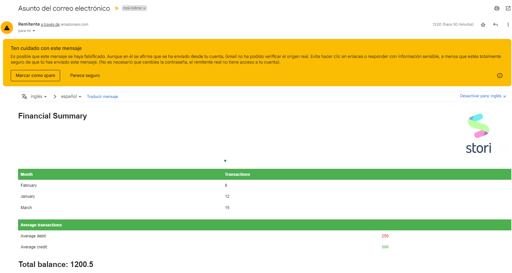

# Stori challenge
This code is a system that processes a file containing debit and credit transactions on an account. The system retrieves the file from a mounted directory in Amazon S3 and sends summary information to a user via email.

To run this code, you will need to populate the configurations in the internal/localconfig folder. 
You will need to provide AWS access credentials, AWS region, setupemail, and database connection details.

This code uses Amazon RDS PostgreSQL as the database and Amazon SES to send email notifications.

This code uses the following dependencies:

- AWS SDK for Go
- Goose for database migrations
- Postgres driver for Go

In future updates, I plan to add support for local development using LocalStack and complete testing using mocks. Additionally, I plan to use the Go mock CLI to help with testing, and also terraform for resource infra automation or AWS SAM with CloudFormation.

## Emial view
This is and exmaple of email sent it:

